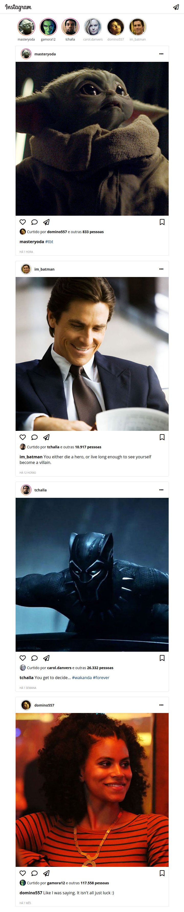

<h1 align="center">
  :camera: Instagram Codenation 
  
  
  
</h1>
  
> O desafio foi Desenvolver uma versão mobile first do Instagram utilizando apenas **HTML5** e **CSS3**.

### Preview:

> **Live Demo:**
> 👉 [Instagram Codenation](https://renatomarquesteles.github.io/codenation-instagram/public)

### Instalação

1. Clone este repositório em uma pasta qualquer
2. Abra o arquivo `public/index.html`
